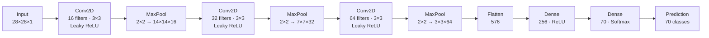
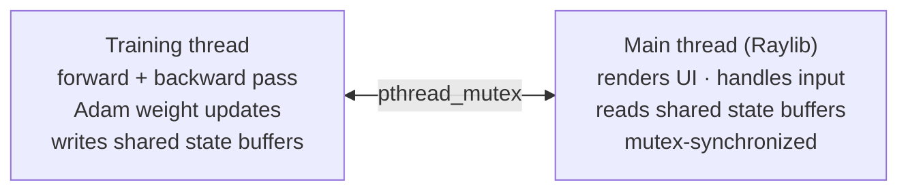

# CNN from Scratch in C

A Convolutional Neural Network built entirely from scratch in C99 — no ML frameworks, no BLAS, no autograd. Hand-coded backpropagation, Adam optimizer, and real-time training visualization using Raylib. Trained on a merged 70-class dataset (EMNIST + Google QuickDraw).

---

## Network Architecture



**70 classes:** EMNIST digits (10) + balanced letters (26) + Google QuickDraw categories (apple, book, car, clock, face, star, tree, …)

---

## Implementation

**Forward pass:** 3×3 sliding-window convolution applied manually per filter per output pixel. Max-pooling records argmax indices for gradient routing during backprop. Softmax on the output layer computes class probabilities via the numerically stable log-sum-exp formulation.

**Backward pass:** full chain rule through all layers, manually coded:
- Dense layers: `dW = input^T · dOut`, `db = sum(dOut)`
- Max-pool: gradient flows only to the saved argmax position
- Conv layers: error maps convolved with 180°-rotated weight kernels (full convolution)

**Adam optimizer:** per-weight momentum `m` and velocity `v` estimates with bias correction. Each weight gets its own adaptive learning rate — faster convergence than SGD on this architecture, especially in the early training epochs.

**He initialization:** weights sampled from `N(0, √(2/n_inputs))` — prevents vanishing/exploding gradients through deep conv stacks at initialization.

---

## Threading Model

Two threads, one mutex:



Training and rendering run concurrently — the UI never blocks on a forward pass, and the training loop never waits for a frame.

---

## Visualization

**Dashboard tab:**
- 28×28 draw canvas — draw digits, letters, or shapes
- Robot vision panel — shows the preprocessed input the network sees
- Feature map heatmaps — live activation of all layers for the current input
- Top-5 confidence bar chart

**Training analytics tab:**
- Live loss and validation accuracy curves
- Activation heatmaps across all three conv layers
- Weight histograms per layer — watch for vanishing/exploding gradients

---

## Dataset Pipeline

Automated via CMake + Python:

1. Downloads EMNIST balanced split (digits + letters)
2. Downloads selected Google QuickDraw categories
3. Normalizes orientation (QuickDraw uses flipped Y-axis vs EMNIST)
4. Merges into a single idx3-ubyte binary — the same format as original MNIST

The merged dataset is regenerated on first build. Subsequent builds use the cached binary.

---

## Building

**Requirements:** GCC/Clang with OpenMP · CMake 3.24+ · Python 3

```bash
mkdir build && cd build
cmake ..      # downloads Raylib, sets up venv, runs data.py
make
./draw_predictor
```
